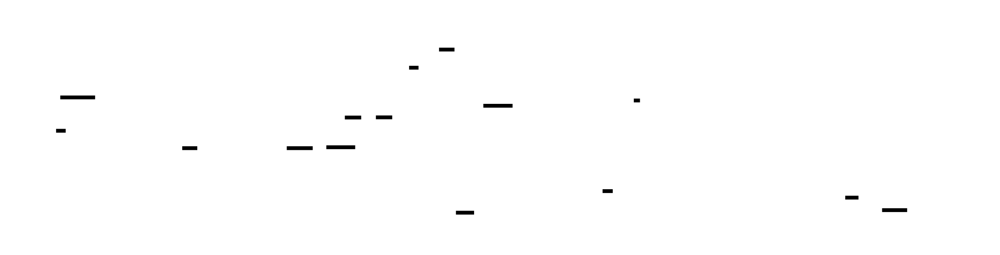
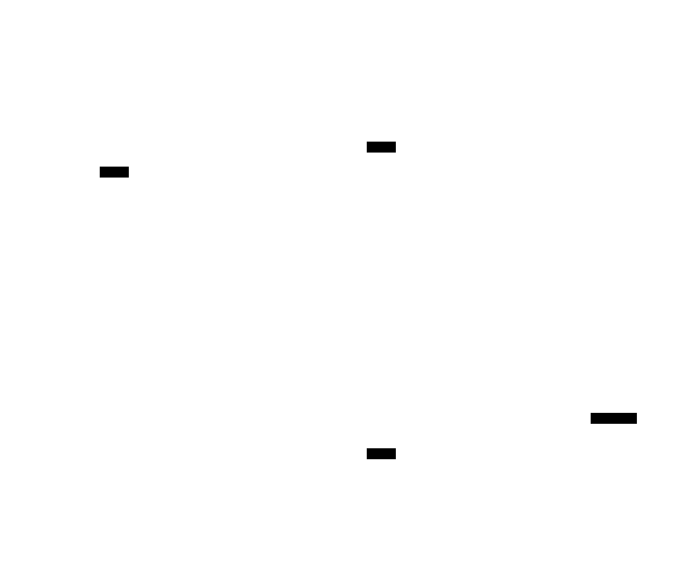
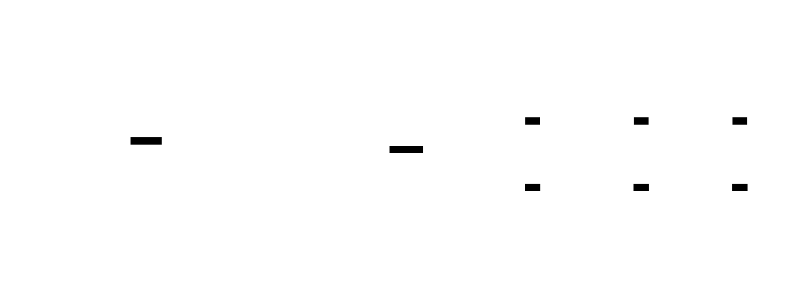

# DataKit Architecture

This document describes the high-level architecture of DataKit.

## Overview

DataKit is a Kubernetes-native data pipeline platform that enables teams to contribute reusable, versioned "data packages" with a complete developer workflow.



## Components

### 1. CLI (`cli/`)

The command-line interface for interacting with the platform.

**Responsibilities:**
- Package scaffolding (`dk init`)
- Local development (`dk dev`, `dk run`)
- Validation (`dk lint`, `dk test`)
- Publishing (`dk build`, `dk publish`)
- Promotion (`dk promote`)
- Observability (`dk status`, `dk logs`)

**Technology:** Go, Cobra

### 2. SDK (`sdk/`)

Core libraries used by the CLI and controller.

#### 2.1 Validate (`sdk/validate/`)
- Manifest validation (dk.yaml, connector, store, DataSet manifests)
- PII classification validation
- Schema validation

#### 2.2 Lineage (`sdk/lineage/`)
- OpenLineage event types
- Marquez emitter implementation
- Event builder pattern

#### 2.3 Registry (`sdk/registry/`)
- OCI artifact management using ORAS
- Bundler for creating artifacts
- Client for push/pull operations

#### 2.4 Runner (`sdk/runner/`)
- Local execution via Docker
- Lineage emission integration
- Run tracking

#### 2.5 Promotion (`sdk/promotion/`)
- Cell-based promotion via GitHub API
- Values file generation and merge (preserves overrides)
- PR creation with env/cell targeting

#### 2.6 Catalog (`sdk/catalog/`)
- Data catalog record types
- Marquez integration
- Metadata management

### 3. Contracts (`contracts/`)

Shared types and schemas for the five manifest kinds.

```go
// Transform is a unit of computation that reads/writes Assets.
type Transform struct {
    APIVersion string
    Kind       string
    Metadata   TransformMetadata
    Spec       TransformSpec
}

// DataSetRef is a reference to a named DataSet.
type DataSetRef struct {
    DataSet string            // DataSet name (mutually exclusive with Tags)
    Tags    map[string]string // Match DataSets by labels
    Version string            // Semver range constraint
    Cell    string            // Cell qualifier
}

// DataSetManifest represents a data contract in a Store.
type DataSetManifest struct {
    APIVersion string
    Kind       string
    Metadata   DataSetMetadata
    Spec       DataSetSpec
}
```

### 4. Platform Controller (`platform/controller/`)

Kubernetes controller for managing data packages.

**CRDs:**
- `PackageDeployment`: Represents a deployed data package

**Reconciliation Loop:**
1. Watch for PackageDeployment changes
2. Pull OCI artifact from registry
3. Extract pipeline configuration
4. Create/update Kubernetes Jobs
5. Monitor execution and emit metrics

### 5. GitOps (`gitops/`)

Cell-based deployment layout with a shared Helm chart.

```
gitops/
├── charts/
│   └── dk-app/              # Shared Helm chart for all packages
│       ├── Chart.yaml
│       ├── values.yaml
│       └── templates/
│           └── packagedeployment.yaml
├── envs/
│   ├── dev/
│   │   └── cells/
│   │       └── c0/
│   │           ├── stores/   # Cell-specific Store CRDs
│   │           └── apps/     # Per-package values.yaml (managed by dk promote)
│   ├── int/
│   │   └── cells/c0/{stores,apps}
│   └── prod/
│       └── cells/
│           ├── c0/{stores,apps}
│           └── canary/{stores,apps}
├── crds/                     # CRD definitions
└── argocd/
    └── applicationset.yaml   # Git generator on envs/*/cells/*/apps/*
```

ArgoCD discovers apps via a git generator on `gitops/envs/*/cells/*/apps/*`, renders the shared `dk-app` chart with each app's `values.yaml`, and applies `PackageDeployment` CRs to the target namespace.

## Module Dependency Graph



## Package × Cell Model



## Data Flow

### Local Development

```
Developer → dk init → Creates dk.yaml
         → dk dev up → Deploys embedded Helm charts to k3d
                        (Redpanda, LocalStack, PostgreSQL, Marquez)
                        Init jobs seed topics, buckets, schemas, namespaces
         → dk run → Builds container, runs locally
         → Lineage events → Marquez
```

#### Helm Chart Deployment Mechanism

The `dk dev up` command uses a uniform Helm chart deployment mechanism:

1. **Embedded Charts**: All dev dependency charts are embedded in the CLI binary via Go's `embed.FS` (`sdk/localdev/charts/`)
2. **Chart Registry**: A `DefaultCharts` registry defines each chart's port-forwarding rules, health labels, display endpoints, and timeouts
3. **Uniform Deployment**: `charts.DeployCharts()` extracts charts to a temp directory and runs `helm upgrade --install` in parallel
4. **Init Jobs**: Each chart includes Helm hook jobs (post-install/post-upgrade) that automatically create required resources (Kafka topics, S3 buckets, DB schemas, Marquez namespaces)
5. **Config Overrides**: Users can override chart versions (`dev.charts.<name>.version`) or Helm values (`dev.charts.<name>.values.<path>`) via the hierarchical config system
6. **Upstream Subcharts**: Redpanda and PostgreSQL wrap upstream Helm charts as subcharts, inheriting production-quality templates while providing dev-appropriate value overrides

Adding a new dev dependency requires only:

- Creating a chart directory under `sdk/localdev/charts/<name>/`
- Registering a `ChartDefinition` in the `DefaultCharts` slice in `embed.go`
- No changes to deployment, health-checking, port-forwarding, or CLI code

### Promotion Flow


```
Developer → dk build → Validates & bundles OCI artifact
         → dk publish → Pushes to OCI registry (digest-based)
         → dk promote --to dev → Creates PR to update values.yaml
         → PR merged → ArgoCD syncs
         → Controller → Pulls artifact, creates Job
```

### Lineage Tracking

```
Runner emits OpenLineage events:
  START → Job begins execution
  COMPLETE → Job finished successfully
  FAIL → Job failed with error

Events sent to:
  Marquez (local) → http://localhost:5000/api/v1/lineage
  Marquez (prod) → Configured via environment
```

## Key Design Decisions

### 1. OCI for Package Storage

**Rationale:**
- Immutable by design (content-addressable)
- Existing tooling (Docker registries, Harbor)
- Standard format with ecosystem support

### 2. GitOps for Promotion

**Rationale:**
- Auditable change history
- Declarative desired state
- Rollback = git revert
- No direct cluster access needed

### 3. Shared Helm Chart

**Rationale:**
- One `dk-app` chart for all packages eliminates per-package chart generation
- `appVersion` in per-app `values.yaml` drives the package version
- ArgoCD git generator auto-discovers new apps from directory structure
- User overrides (resources, replicas, schedule) are preserved across promotions

### 4. OpenLineage for Lineage

**Rationale:**
- Industry standard
- Marquez integration
- Vendor neutral

### 5. Go Monorepo

**Rationale:**
- Independent versioning per module
- Shared contracts
- Single CI pipeline
- Clear dependency direction

## Scaling Considerations

| Aspect | MVP | Scale Target |
|--------|-----|--------------|
| Packages | 10-50 | 500+ |
| Environments | 3 | 10+ |
| Cells per env | 1-3 | 10+ |
| Concurrent runs | 10 | 100+ |
| OCI artifact size | <500MB | <1GB |

## Security Model

1. **No Secrets in Code**: All secrets via Kubernetes/external-secrets
2. **PII Metadata**: Required classification on outputs
3. **Immutable Artifacts**: No modification after publish
4. **PR-based Promotion**: Audit trail for all changes
5. **RBAC**: Kubernetes RBAC for controller

## Observability

### Metrics
- `dk_run_total{status,package,namespace}`
- `dk_run_duration_seconds{package,namespace}`
- `dk_controller_reconcile_total{result}`

### Logging
- Structured JSON with slog
- Correlation IDs for tracing
- Levels: DEBUG, INFO, WARN, ERROR

### Dashboards
- Pipeline health: `dashboards/pipeline-health.json`
- Controller metrics: `dashboards/controller.json`
