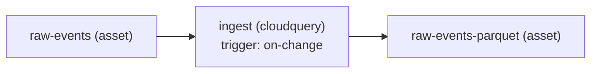

# CLI Reference

Complete reference for all `dp` CLI commands with examples and flags.

## Global Flags

These flags apply to all commands:

| Flag | Short | Description | Default |
|------|-------|-------------|---------|
| `--output` | `-o` | Output format (table, json, yaml) | table |
| `--help` | `-h` | Show help | - |
| `--version` | `-v` | Show version | - |

---

## Commands Overview

| Command | Description |
|---------|-------------|
| [`dp init`](#dp-init) | Create a new data package |
| [`dp dev`](#dp-dev) | Manage local development stack |
| [`dp dev seed`](#dp-dev-seed) | Load seed data into local dev stores |
| [`dp config`](#dp-config) | Manage dp configuration |
| [`dp lint`](#dp-lint) | Validate package manifests |
| [`dp run`](#dp-run) | Execute pipeline locally |
| [`dp show`](#dp-show) | Show effective manifest |
| [`dp test`](#dp-test) | Run pipeline tests |
| [`dp build`](#dp-build) | Build OCI artifact |
| [`dp publish`](#dp-publish) | Publish to registry |
| [`dp promote`](#dp-promote) | Promote to environment |
| [`dp cell list`](#dp-cell-list) | List cells in the cluster |
| [`dp cell show`](#dp-cell-show) | Show cell details |
| [`dp cell stores`](#dp-cell-stores) | List stores in a cell |
| [`dp status`](#dp-status) | Show package status |
| [`dp logs`](#dp-logs) | Stream logs |
| [`dp rollback`](#dp-rollback) | Rollback to previous version |
| [`dp lineage`](#dp-lineage) | View data lineage *(not yet implemented)* |
| [`dp asset create`](#dp-asset-create) | Create a new asset from an extension |
| [`dp asset validate`](#dp-asset-validate) | Validate asset configuration |
| [`dp asset list`](#dp-asset-list) | List all assets in the project |
| [`dp asset show`](#dp-asset-show) | Show details of an asset |
| [`dp pipeline create`](#dp-pipeline-create) | Create a pipeline workflow from a template |
| [`dp pipeline run`](#dp-pipeline-run) | Execute the pipeline workflow |
| [`dp pipeline backfill`](#dp-pipeline-backfill) | Re-execute sync steps for a date range |
| [`dp pipeline show`](#dp-pipeline-show) | Display pipeline definition and schedule |

---

## dp init

Create a new data package.

```bash
dp init <package-name> [flags]
```

### Flags

| Flag | Short | Description | Default |
|------|-------|-------------|---------|
| `--runtime` | `-r` | Runtime (cloudquery, generic-go, generic-python, dbt) | |
| `--mode` | `-m` | Execution mode: batch, streaming | batch |
| `--namespace` | `-n` | Package namespace | default |
| `--owner` | | Package owner | current user |
| `--team` | | Team label | my-team |

### Examples

```bash
# Create a Transform with CloudQuery runtime
dp init my-sync --runtime cloudquery
```

```bash
# Create a streaming Python Transform
dp init kafka-processor --runtime generic-python --mode streaming
```

```bash
# Create a Go Transform
dp init etl-job --runtime generic-go
```

```bash
# Create a dbt Transform
dp init user-aggregation --runtime dbt
```

### Output

Creates the following directory structure (varies by runtime):

```
my-pipeline/
├── dp.yaml
├── main.py (or main.go)
└── requirements.txt (Python only)
```

For CloudQuery runtime:

```
my-model/
├── dp.yaml
└── config.yaml
```

---

## dp dev

Manage the local development stack.

### dp dev up

Start the local development stack.

```bash
dp dev up [flags]
```

#### Flags

| Flag | Description | Default |
|------|-------------|---------|
| `--runtime` | Runtime to use | k3d |
| `--detach` | Run in background | false |
| `--timeout` | Startup timeout | 60s |

#### Examples

```bash
# Start local stack with k3d (default)
dp dev up
```

```bash
# Start in background
dp dev up --detach
```

### dp dev down

Stop the local development stack.

```bash
dp dev down [flags]
```

#### Flags

| Flag | Description | Default |
|------|-------------|---------|
| `--runtime` | Runtime to use (k3d, compose) | k3d |
| `--volumes` | Remove volumes | false |

#### Examples

```bash
# Stop stack
dp dev down
```

```bash
# Stop compose stack and remove volumes
dp dev down --runtime=compose --volumes
```

### dp dev seed

Load seed data into local dev stores.

```bash
dp dev seed [package-dir] [flags]
```

Reads each input asset in the package and, for assets that declare a
`dev.seed` section, creates the table (if missing) and inserts sample data
into the backing database in the local k3d cluster.

Seed runs are **idempotent**: a SHA-256 checksum of the resolved rows is
stored in a `_dp_seed_meta` table. If the data hasn't changed since the
last seed, the asset is skipped entirely.

When the data *does* change (or when `--force` / `--clean` is used), the
table is `TRUNCATE`d before inserting so the contents always match the
seed spec exactly — no stale rows, no duplicate-key errors.

#### Flags

| Flag | Description | Default |
|------|-------------|--------|
| `--profile` | Use a named seed profile instead of the default | |
| `--force` | Re-seed even when data is unchanged | false |
| `--clean` | Drop and recreate tables before seeding | false |
| `--asset` | Seed only a specific asset by name | (all) |

#### Examples

```bash
# Seed all input assets (skips if data unchanged)
dp dev seed
```

```bash
# Use a named seed profile for integration tests
dp dev seed --profile edge-cases
```

```bash
# Force re-seed even if data hasn't changed
dp dev seed --force
```

```bash
# Drop and recreate tables (full reset)
dp dev seed --clean
```

```bash
# Seed only a specific asset
dp dev seed --asset users-source-table
```

```bash
# Seed from a specific package directory
dp dev seed ./my-pipeline
```

#### Output Example

```
Seeding users-source-table (example_table, profile=default): 3 row(s)...

✓ Seeded 1 asset(s), 3 row(s) inserted
```

On subsequent runs with unchanged data:

```
Skipping users-source-table (profile=default): data unchanged

✓ Seeded 0 asset(s), 0 row(s) inserted, 1 unchanged (skipped)
```

!!! tip "Auto-seeding during `dp run`"
    Seed data is also loaded automatically before each `dp run` execution.
    The checksum skip ensures this adds no overhead when data is unchanged.

### dp dev status

Show status of local development stack.

```bash
dp dev status [flags]
```

#### Flags

| Flag | Description | Default |
|------|-------------|---------|
| `--runtime` | Runtime to use (k3d, compose) | k3d |

#### Output Example

```
Local Development Stack (k3d)
─────────────────────────────
Chart         Status    Ports
redpanda      healthy   19092, 18081
localstack    healthy   4566
postgres      healthy   5432
marquez       healthy   5000, 3000

Endpoints:
  Kafka:              localhost:19092
  Schema Registry:    http://localhost:18081
  S3 API:             http://localhost:4566
  PostgreSQL:         localhost:5432
  Marquez API:        http://localhost:5000
  Marquez Web:        http://localhost:3000
```

---

## dp config

Manage dp CLI configuration settings.

Configuration is stored in YAML files at three scopes (highest to lowest precedence):

- **repo**: `{git-root}/.dp/config.yaml`
- **user**: `~/.config/dp/config.yaml`
- **system**: `/etc/datakit/config.yaml`

### dp config set

Set a configuration value.

```bash
dp config set <key> <value> [--scope <scope>]
```

#### Flags

| Flag | Description | Default |
|------|-------------|---------|
| `--scope` | Config scope: repo, user, or system | user |

#### Valid Keys

| Key | Description | Allowed Values |
|-----|-------------|----------------|
| `dev.runtime` | Runtime type | `k3d`, `compose` |
| `dev.workspace` | Path to DP workspace | any path |
| `dev.k3d.clusterName` | k3d cluster name | DNS-safe name |
| `dev.charts.<name>.version` | Override chart version | semver (e.g., `25.2.0`) |
| `dev.charts.<name>.values.<path>` | Override Helm values | any value |
| `plugins.registry` | Default OCI registry | valid registry URL |
| `plugins.overrides.<name>.version` | Pin plugin version | semver (e.g., `v8.13.0`) |
| `plugins.overrides.<name>.image` | Override plugin image | full image reference |

#### Examples

```bash
# Set default plugin registry
dp config set plugins.registry ghcr.io/myteam

# Pin a plugin version
dp config set plugins.overrides.postgresql.version v8.13.0

# Override a dev chart version
dp config set dev.charts.redpanda.version 25.2.0

# Override a Helm value for a dev chart
dp config set dev.charts.postgres.values.primary.resources.limits.memory 1Gi

# Set for this project only
dp config set plugins.registry internal.registry.io --scope repo
```

### dp config get

Get the effective value of a configuration key.

```bash
dp config get <key>
```

Shows the resolved value and which scope it comes from (repo, user, system, or built-in).

#### Examples

```bash
dp config get plugins.registry
# ghcr.io/infobloxopen (source: built-in)

dp config get dev.runtime
# k3d (source: built-in)
```

### dp config unset

Remove a configuration value from a scope.

```bash
dp config unset <key> [--scope <scope>]
```

#### Flags

| Flag | Description | Default |
|------|-------------|---------|
| `--scope` | Config scope: repo, user, or system | user |

#### Examples

```bash
dp config unset plugins.registry
dp config unset plugins.overrides.postgresql.version --scope repo
```

### dp config list

List all effective configuration settings.

```bash
dp config list [--scope <scope>]
```

#### Flags

| Flag | Description | Default |
|------|-------------|---------|
| `--scope` | Show settings from a specific scope only | (all scopes) |

#### Output Example

```
KEY                    VALUE                     SOURCE
dev.runtime            k3d                       built-in
dev.k3d.clusterName    dp-local                  built-in
plugins.registry       ghcr.io/myteam            repo
```

### dp config add-mirror

Add a fallback registry mirror.

```bash
dp config add-mirror <registry> [--scope <scope>]
```

Mirrors are tried in order when the primary registry is unreachable.

#### Examples

```bash
dp config add-mirror ghcr.io/backup-org
dp config add-mirror internal.registry.io --scope repo
```

### dp config remove-mirror

Remove a fallback registry mirror.

```bash
dp config remove-mirror <registry> [--scope <scope>]
```

#### Examples

```bash
dp config remove-mirror ghcr.io/backup-org
```

---

## dp lint

Validate package manifests.

```bash
dp lint [package-dir] [flags]
```

### Flags

| Flag | Short | Description | Default |
|------|-------|-------------|---------|
| `--strict` | - | Treat warnings as errors | false |
| `--skip-pii` | - | Skip PII classification validation | false |
| `--set` | - | Override values (key=value, repeatable) | - |
| `--values` | `-f` | Override files (repeatable) | - |

### Validated Files

| File | Description |
|------|-------------|
| `dp.yaml` | Package manifest (includes runtime config) |
| `schemas/` | Schema files |

### Validation Rules

| Code | Description |
|------|-------------|
| E001-E003 | Required fields |
| E004-E005 | Schema references |
| E010-E011 | Binding configuration |
| E025 | PII classification required |
| E030-E031 | Runtime configuration |
| E040-E041 | Runtime required for transform |

### Examples

```bash
# Lint current directory
dp lint
```

```bash
# Lint specific package
dp lint ./my-pipeline
```

```bash
# Lint with overrides applied
dp lint ./my-pipeline -f production.yaml

# Lint with inline override
dp lint ./my-pipeline --set spec.image=myimage:v2
```

```bash
# Strict mode (warnings become errors)
dp lint --strict
```

---

## dp run

Execute pipeline locally.

```bash
dp run [package-dir] [flags]
```

### Flags

| Flag | Short | Description | Default |
|------|-------|-------------|---------|
| `--cell` | - | Cell name for store resolution (overrides `store/` directory) | - |
| `--context` | - | kubectl context for multi-cluster cell access | current context |
| `--network` | - | Docker network | dp-network |
| `--env` | - | Environment variables (KEY=VALUE) | - |
| `--dry-run` | - | Print what would run | false |
| `--detach` | - | Run in background | false |
| `--attach` | - | Attach to logs (streaming mode) | true |
| `--timeout` | - | Execution timeout | 30m |
| `--set` | - | Override values (key=value, repeatable) | - |
| `--values` | `-f` | Override files (repeatable) | - |
| `--sync` | - | Run a full CloudQuery sync (source → destination) | false |
| `--destination` | - | Destination plugin for sync (file, postgresql, s3) | file |
| `--registry` | - | Override plugin registry for this invocation | (from config) |

### Mode-aware Behavior

The run command behaves differently based on the pipeline mode:

**Batch Mode (default)**:
- Runs to completion
- Streams logs until exit
- Returns exit code

**Streaming Mode**:
- Runs indefinitely
- `--attach`: Stream logs (Ctrl+C sends SIGTERM)
- `--detach`: Returns immediately with container ID
- Use `dp logs` to view detached output
- Use `dp stop` to stop

### Runtime Configuration

The pipeline runs using the container image specified in `spec.image` and the execution engine specified in `spec.runtime` of dp.yaml.
Environment variables are automatically mapped from Store connection details (e.g., `events-store.brokers` → `EVENTS_STORE_BROKERS`).

### Override Precedence

When using `-f` and `--set` flags:

1. **Base**: dp.yaml values
2. **Files**: Values from `-f` files (applied in order)
3. **Set flags**: `--set` values (applied in order, highest precedence)

### Examples

```bash
# Run batch pipeline
dp run ./my-pipeline
```

```bash
# Run streaming pipeline (attached by default)
dp run ./my-streaming-pipeline

# Run streaming pipeline detached
dp run ./my-streaming-pipeline --detach
```

```bash
# Override image for testing
dp run ./my-pipeline --set spec.image=local:dev
```

```bash
# Apply environment-specific overrides
dp run ./my-pipeline -f production.yaml
```

```bash
# Combine overrides (--set wins over -f)
dp run ./my-pipeline -f production.yaml --set spec.timeout=1h
```

```bash
# With environment variables
dp run ./my-pipeline --env API_KEY=secret --env DEBUG=true
```

```bash
# Run against a cell (stores resolved from cell, not store/ dir)
dp run --cell canary
```

```bash
# Run against a cell in a specific cluster
dp run --cell us-east --context arn:aws:eks:us-east-1:...:dp-prod
```

```bash
# Run a CloudQuery plugin (auto-detected from dp.yaml type: cloudquery)
dp run ./my-source
```

**CloudQuery Mode** (when `spec.runtime: cloudquery`):

When `dp run` detects a CloudQuery package, it orchestrates a full sync:

1. Checks for `cloudquery` CLI in PATH
2. Builds the plugin Docker image
3. Starts the container with gRPC port exposed
4. Waits for gRPC server health check (30s timeout)
5. Generates a sync configuration (source → PostgreSQL)
6. Runs `cloudquery sync`
7. Displays sync summary
8. Cleans up the container

---

## dp show

Show the effective manifest after applying overrides.

```bash
dp show [package-dir] [flags]
```

### Flags

| Flag | Short | Description | Default |
|------|-------|-------------|---------|
| `--set` | - | Override values (key=value, repeatable) | - |
| `--values` | `-f` | Override files (repeatable) | - |
| `--output` | `-o` | Output format (yaml, json) | yaml |

### Description

The `dp show` command displays the merged manifest that would be used when running the pipeline.
This is useful for previewing the effect of override files and `--set` flags before executing.

### Examples

```bash
# Show manifest as-is
dp show ./my-pipeline
```

```bash
# Show with override file applied
dp show ./my-pipeline -f production.yaml
```

```bash
# Show with inline overrides
dp show ./my-pipeline --set spec.image=myimage:v2
```

```bash
# Show combined overrides (--set wins over -f)
dp show ./my-pipeline -f base.yaml --set spec.timeout=1h
```

```bash
# Output as JSON
dp show ./my-pipeline -o json
```

---

## dp test

Run tests for a data package.

```bash
dp test [package-dir] [flags]
```

### Flags

| Flag | Description | Default |
|------|-------------|---------|
| `--data` | Test data directory | testdata/ |
| `--timeout` | Test timeout | 5m |
| `--duration` | Test duration (streaming mode) | 30s |
| `--startup-timeout` | Wait for healthy (streaming mode) | 60s |
| `--integration` | Run CloudQuery integration test (full sync) | false |

### Mode-aware Testing

**Batch Mode**:
- Runs pipeline with test data
- Waits for completion
- Reports success/failure based on exit code

**Streaming Mode**:
- Starts pipeline container
- Waits for health check (up to `--startup-timeout`)
- Runs for `--duration`
- Sends SIGTERM for graceful shutdown
- Reports success if no errors during run

**CloudQuery Mode** (when `spec.type: cloudquery`):
- Automatically detects project language (Python or Go)
- Runs `pytest` (Python) or `go test ./...` (Go) for unit tests
- With `--integration`: builds container, starts gRPC server, runs `cloudquery sync`

### Examples

```bash
# Run batch test
dp test ./my-pipeline
```

```bash
# With custom test data
dp test ./my-pipeline --data ./test/fixtures
```

```bash
# Test streaming pipeline for 60 seconds
dp test ./my-streaming-pipeline --duration 60s

# Test with longer startup wait
dp test ./my-streaming-pipeline --startup-timeout 120s
```

```bash
# Run CloudQuery unit tests
dp test ./my-source

# Run CloudQuery integration test (full sync)
dp test ./my-source --integration
```

---

## dp build

Build OCI artifact for package.

```bash
dp build [package-dir] [flags]
```

### Flags

| Flag | Description | Default |
|------|-------------|---------|
| `--tag` | Artifact tag | `<version from dp.yaml>` |
| `--no-cache` | Build without cache | false |

### Examples

```bash
# Build package
dp build ./my-pipeline
```

```bash
# With custom tag
dp build ./my-pipeline --tag v1.0.0-rc1
```

### Output

```
▶ Building package: my-pipeline
  → Validating manifest...
  → Bundling files...
  → Creating OCI artifact...
✓ Built: my-pipeline:v1.0.0

Artifact: ghcr.io/org/my-pipeline:v1.0.0
Size: 2.3 MB
```

---

## dp publish

Publish package to OCI registry.

```bash
dp publish [package-dir] [flags]
```

### Flags

| Flag | Description | Default |
|------|-------------|---------|
| `--registry` | Registry URL | `$DP_REGISTRY` |
| `--tag` | Override tag | - |
| `--dry-run` | Print what would publish | false |

### Environment Variables

| Variable | Description |
|----------|-------------|
| `DP_REGISTRY` | Default registry URL |
| `DP_REGISTRY_USER` | Registry username |
| `DP_REGISTRY_TOKEN` | Registry access token |

### Examples

```bash
# Publish to default registry
dp publish ./my-pipeline
```

```bash
# Publish to specific registry
dp publish ./my-pipeline --registry ghcr.io/myorg
```

```bash
# Dry run
dp publish ./my-pipeline --dry-run
```

---

## dp promote

Promote package to an environment.

```bash
dp promote <package-name> <version> [flags]
```

### Flags

| Flag | Description | Default |
|------|-------------|---------|
| `--to` | Target environment | **required** |
| `--dry-run` | Print what would change | false |
| `--auto-merge` | Automatically merge PR | false |
| `--rollback` | Mark as rollback (expedited) | false |

### Examples

```bash
# Promote to dev
dp promote my-pipeline v1.0.0 --to dev
```

```bash
# Promote to production with dry run
dp promote my-pipeline v1.0.0 --to prod --dry-run
```

```bash
# Emergency rollback
dp promote my-pipeline v0.9.0 --to prod --rollback
```

### Output

```
Promotion Request: my-pipeline v1.0.0 → dev
━━━━━━━━━━━━━━━━━━━━━━━━━━━━━━━━━━━━━━━━

Pre-flight Checks:
  ✓ Package exists in registry
  ✓ Version not already in dev
  ✓ Passed lint validation

Created PR: https://github.com/org/deploys/pull/123
```

---

## dp cell

Manage and inspect cells in the cluster.

### dp cell list

List all cells in the current cluster.

```bash
dp cell list [flags]
```

#### Flags

| Flag | Description | Default |
|------|-------------|---------|
| `--context` | kubectl context to use | current context |

#### Example

```bash
dp cell list
```

```
NAME      NAMESPACE    READY   STORES   PACKAGES   LABELS
local     dp-local     true    2        3          tier=local
canary    dp-canary    true    2        1          tier=canary,region=us-east-1
stable    dp-stable    true    2        5          tier=production,region=us-east-1
```

```bash
# List cells in a different cluster
dp cell list --context arn:aws:eks:us-east-1:...:cluster/dp-prod
```

### dp cell show

Show details of a specific cell.

```bash
dp cell show <cell-name> [flags]
```

#### Flags

| Flag | Description | Default |
|------|-------------|---------|
| `--context` | kubectl context to use | current context |

#### Example

```bash
dp cell show canary
```

```
Cell: canary
  Namespace:  dp-canary
  Ready:      true
  Stores:     2
  Packages:   1
  Labels:
    tier=canary
    region=us-east-1

Stores:
  NAME           CONNECTOR   READY
  source-db      postgres    true
  dest-bucket    s3          true
```

### dp cell stores

List stores in a specific cell.

```bash
dp cell stores <cell-name> [flags]
```

#### Flags

| Flag | Description | Default |
|------|-------------|---------|
| `--context` | kubectl context to use | current context |

#### Example

```bash
dp cell stores canary
```

```
NAME           CONNECTOR   READY   AGE
source-db      postgres    true    2d
dest-bucket    s3          true    2d
warehouse      postgres    true    5h
```

---

## dp status

Show package status across environments.

```bash
dp status [package-name] [flags]
```

### Flags

| Flag | Description | Default |
|------|-------------|---------|
| `--env` | Filter by environment | all |
| `--namespace` | Filter by namespace | all |

### Examples

```bash
# Show status of all packages
dp status
```

```bash
# Show specific package
dp status my-pipeline
```

```bash
# Filter by environment
dp status --env prod
```

### Output

```
Package: my-pipeline
━━━━━━━━━━━━━━━━━━━

Environment  Version   Status    Last Run
───────────  ───────   ──────    ────────
dev          v1.0.0    Synced    5 min ago
int          v0.9.0    Synced    1 day ago
prod         v0.9.0    Synced    6 hours ago
```

---

## dp logs

Stream logs from a running or completed pipeline.

```bash
dp logs <run-id> [flags]
```

### Flags

| Flag | Short | Description | Default |
|------|-------|-------------|---------|
| `--follow` | `-f` | Follow log output | true |
| `--tail` | `-n` | Lines to show | all |
| `--since` | - | Show logs since (e.g., "1h", "2024-01-01") | - |
| `--timestamps` | `-t` | Show timestamps | false |

### Examples

```bash
# Get logs (follows by default)
dp logs my-pipeline-20250122-120000
```

```bash
# Get last 100 lines without following
dp logs my-pipeline-20250122-120000 --tail 100 --follow=false
```

```bash
# Show logs from last hour
dp logs my-pipeline-20250122-120000 --since 1h
```

```bash
# Show timestamps
dp logs my-pipeline-20250122-120000 --timestamps
```

---

## dp rollback

Rollback to a previous version.

```bash
dp rollback <package-name> [flags]
```

### Flags

| Flag | Description | Default |
|------|-------------|---------|
| `--to` | Target version | previous |
| `--env` | Environment | **required** |
| `--dry-run` | Print what would change | false |

### Examples

```bash
# Rollback to previous version
dp rollback my-pipeline --env prod
```

```bash
# Rollback to specific version
dp rollback my-pipeline --to v1.0.0 --env prod
```

---

## dp lineage

!!! warning "Not Yet Implemented"
    The `dp lineage` command is planned but not yet available. For now, view lineage through the Marquez UI at http://localhost:3000 when the local dev stack is running (`dp dev up`).

View data lineage for a package.

```bash
dp lineage <package-name> [flags]
```

### Planned Flags

| Flag | Description | Default |
|------|-------------|---------|
| `--upstream` | Show upstream sources | true |
| `--downstream` | Show downstream consumers | true |
| `--depth` | Maximum depth to traverse | 3 |
| `--refresh` | Force refresh from backend | false |

### Examples

```bash
# View lineage
dp lineage my-pipeline
```

```bash
# Only downstream impact
dp lineage my-pipeline --upstream=false
```

### Output

```
Lineage for: my-pipeline
━━━━━━━━━━━━━━━━━━━━━━━━━━━

Upstream:
  ├─ kafka://production/user-events
  └─ postgres://users-db/users

Downstream:
  ├─ s3://analytics-bucket/processed/
  └─ dashboard/user-metrics
```

---

## dp asset create

Create a new asset from an extension.

```bash
dp asset create <name> --ext <vendor.kind.name> [flags]
```

### Flags

| Flag | Short | Description | Default |
|------|-------|-------------|---------|
| `--ext` | | Extension FQN (required) | - |
| `--version` | | Extension version | latest known |
| `--force` | | Overwrite existing asset | false |
| `--interactive` | `-i` | Prompt for each required config field | false |

### Examples

```bash
# Create a source asset
dp asset create aws-security --ext cloudquery.source.aws

# Create with a specific version
dp asset create aws-security --ext cloudquery.source.aws --version v24.0.2

# Overwrite an existing asset
dp asset create aws-security --ext cloudquery.source.aws --force

# Interactive mode
dp asset create aws-security --ext cloudquery.source.aws --interactive
```

### Output

```
✓ Created asset "aws-security" at assets/sources/aws-security/asset.yaml

Next steps:
  1. Edit assets/sources/aws-security/asset.yaml to configure your asset
  2. Set ownerTeam to your team name
  3. Run 'dp asset validate' to validate the config
  4. Add 'aws-security' to the assets section in dp.yaml
```

---

## dp asset validate

Validate asset configuration against the extension's JSON Schema.

```bash
dp asset validate [path] [flags]
```

### Flags

| Flag | Description | Default |
|------|-------------|---------|
| `--offline` | Skip schema validation (structural checks only) | false |

### Arguments

| Argument | Description |
|----------|-------------|
| `path` | Optional path to a specific asset directory or file. If omitted, validates all assets under `assets/`. |

### Examples

```bash
# Validate a single asset
dp asset validate assets/sources/aws-security/

# Validate all assets
dp asset validate

# Structural checks only (offline)
dp asset validate --offline
```

### Error Codes

| Code | Description |
|------|-------------|
| E070 | Required field missing |
| E071 | Invalid extension FQN format |
| E072 | Invalid version format |
| E073 | Asset type does not match extension kind |
| E074 | Config block fails schema validation |
| E075 | Extension schema not found |

---

## dp asset list

List all assets in the project.

```bash
dp asset list [flags]
```

### Flags

| Flag | Short | Description | Default |
|------|-------|-------------|---------|
| `--output` | `-o` | Output format (table, json) | table |

### Examples

```bash
# Table output
dp asset list
```

```
NAME             TYPE     EXTENSION              VERSION   OWNER
aws-security     source   cloudquery.source.aws   v24.0.2   security-data
gcp-infra        source   cloudquery.source.gcp   v10.0.0   infra-team
raw-output       sink     cloudquery.sink.s3       v1.2.0    data-team
```

```bash
# JSON output
dp asset list --output json
```

---

## dp asset show

Show details of a specific asset.

```bash
dp asset show <name> [flags]
```

### Flags

| Flag | Short | Description | Default |
|------|-------|-------------|---------|
| `--output` | `-o` | Output format (yaml, json) | yaml |

### Examples

```bash
# YAML output (default)
dp asset show aws-security
```

```yaml
apiVersion: data.infoblox.com/v1alpha1
kind: Asset
name: aws-security
type: source
extension: cloudquery.source.aws
version: v24.0.2
ownerTeam: security-data
config:
  accounts:
    - "123456789012"
  regions:
    - us-east-1
  tables:
    - aws_s3_buckets
```

```bash
# JSON output
dp asset show aws-security --output json
```

---

## dp pipeline create

Create a pipeline workflow from a template.

```bash
dp pipeline create <name> [flags]
```

### Flags

| Flag | Short | Description | Default |
|------|-------|-------------|---------|
| `--template` | `-t` | Template to use | sync-transform-test |
| `--force` | | Overwrite existing pipeline.yaml | false |
| `--list-templates` | | List available templates and exit | false |

### Available Templates

| Template | Description |
|----------|-------------|
| `sync-transform-test` | Sync → Transform → Test → Publish (default) |
| `sync-only` | Single sync step |
| `custom` | Single custom step with arbitrary image |

### Examples

```bash
# Create with default template
dp pipeline create my-pipeline
```

```bash
# Use a specific template
dp pipeline create my-pipeline --template sync-only
```

```bash
# Overwrite existing pipeline.yaml
dp pipeline create my-pipeline --force
```

```bash
# List available templates
dp pipeline create --list-templates
```

### Output

Creates `pipeline.yaml` in the current directory with the selected template.

---

## dp pipeline run

Execute the pipeline workflow defined in `pipeline.yaml`.

```bash
dp pipeline run [dir] [flags]
```

### Flags

| Flag | Short | Description | Default |
|------|-------|-------------|---------|
| `--env` | `-e` | Environment variables (KEY=VALUE, repeatable) | - |
| `--step` | | Run a single step by name | - |

### Examples

```bash
# Run all steps in the current directory
dp pipeline run
```

```bash
# Run all steps in a specific directory
dp pipeline run ./my-pipeline
```

```bash
# Run a single step
dp pipeline run --step sync-data
```

```bash
# Pass environment variables
dp pipeline run --env DEBUG=true --env LOG_LEVEL=info
```

### Output

Displays step-by-step execution with status icons:

```
Pipeline: my-pipeline
Steps: 3
──────────────────
[sync-data]      output from step...
[transform-data] output from step...
[run-tests]      output from step...
──────────────────
Results:
  ✓ sync-data       [2.3s]
  ✓ transform-data  [1.1s]
  ✓ run-tests       [0.5s]
```

---

## dp pipeline backfill

Re-execute sync steps for a historical date range. Only sync-type steps are executed; transform, test, publish, and custom steps are skipped.

```bash
dp pipeline backfill [dir] [flags]
```

### Flags

| Flag | Short | Description | Default |
|------|-------|-------------|---------|
| `--from` | | Start date (YYYY-MM-DD, required) | - |
| `--to` | | End date (YYYY-MM-DD, required) | - |
| `--env` | `-e` | Additional environment variables (KEY=VALUE) | - |

### Examples

```bash
# Backfill January 2026
dp pipeline backfill --from 2026-01-01 --to 2026-01-31
```

```bash
# Backfill with extra env vars
dp pipeline backfill --from 2026-01-01 --to 2026-01-31 --env BATCH_SIZE=1000
```

### Environment Variables Injected

| Variable | Description |
|----------|-------------|
| `DP_BACKFILL_FROM` | Start date in YYYY-MM-DD format |
| `DP_BACKFILL_TO` | End date in YYYY-MM-DD format |

---

## dp pipeline show

Display the pipeline definition, steps, and schedule — or visualize the
reactive dependency graph of transforms and assets.

```bash
dp pipeline show [dir] [flags]
```

### Modes

The command operates in two modes:

- **Graph mode**: activated with `--all` or `--destination`. Scans directories for
  `dp.yaml` files (Transform and Asset manifests) and renders the dependency graph.
- **Legacy mode**: activated when neither `--all` nor `--destination` is given. Reads
  a `pipeline.yaml` workflow definition from the current directory.

### Flags

| Flag | Short | Description | Default |
|------|-------|-------------|---------|
| `--output` | `-o` | Output format (see below) | auto |
| `--all` | | Show full dependency graph (graph mode) | false |
| `--destination` | | Show dependency chain leading to this asset (graph mode) | |
| `--scan-dir` | | Directories to scan for dp.yaml files (repeatable) | `.` |

**Graph mode output formats:** `text` (default), `mermaid`, `json`, `dot`

**Legacy mode output formats:** `table` (default), `json`, `yaml`

### Examples

```bash
# Show full reactive dependency graph (text tree)
dp pipeline show --all

# Show graph leading to a specific destination asset
dp pipeline show --destination event-summary

# Render the graph as a Mermaid diagram
dp pipeline show --all --output mermaid

# Render as Graphviz DOT
dp pipeline show --all --output dot

# JSON adjacency list
dp pipeline show --all --output json

# Scan specific directories
dp pipeline show --all --scan-dir ./transforms --scan-dir ./assets

# Legacy: table view (default)
dp pipeline show

# Legacy: JSON output
dp pipeline show --output json

# Legacy: YAML output
dp pipeline show --output yaml
```

### Output Example (Graph — Text)

```
Pipeline Dependency Graph
=========================

Assets:
  ▪ raw-events            (kafka-topic)
  ▪ raw-events-parquet    (s3-parquet)
  ▪ enriched-events       (s3-parquet)
  ▪ event-summary         (warehouse-table)

Transforms:
  ⚙ ingest      cloudquery   trigger: on-change
  ⚙ enrich      generic-python trigger: on-change
  ⚙ aggregate   dbt          trigger: schedule (0 */6 * * *)

Dependencies:
  raw-events ──▶ ingest ──▶ raw-events-parquet
  raw-events-parquet ──▶ enrich ──▶ enriched-events
  enriched-events ──▶ aggregate ──▶ event-summary
```

### Output Example (Graph — Mermaid)



### Output Example (Legacy — Table)

```
Pipeline: my-pipeline
Description: Ingest and transform security data

STEP             TYPE        DETAILS
sync-data        sync        source=aws-security sink=postgres-warehouse
transform-data   transform   asset=dbt-security-model
run-tests        test        asset=dbt-security-model cmd=dbt test

Schedule: 0 6 * * * (America/New_York)
```

---

## Exit Codes

| Code | Meaning |
|------|---------|
| 0 | Success |
| 1 | General error |
| 2 | Validation error |
| 3 | Network/connectivity error |
| 4 | Authentication error |

---

## See Also

- [Configuration Reference](configuration.md) - Configuration file and environment variables
- [Manifest Schema](manifest-schema.md) - Package manifest reference
- [Quickstart](../getting-started/quickstart.md) - Get started with dp CLI
