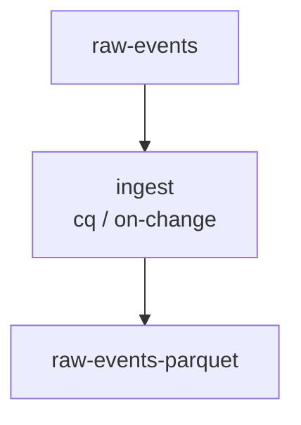

# CLI Reference

Complete reference for all `dk` CLI commands with examples and flags.

## Global Flags

These flags apply to all commands:

| Flag          | Short  | Description                       | Default |
| ------------- | ------ | --------------------------------- | ------- |
| `--output`  | `-o` | Output format (table, json, yaml) | table   |
| `--help`    | `-h` | Show help                         | -       |
| `--version` | `-v` | Show version                      | -       |

---

## Commands Overview

| Command                                        | Description                                |
| ---------------------------------------------- | ------------------------------------------ |
| [`dk init`](#dk-init)                           | Create a new data package                  |
| [`dk dev`](#dk-dev)                             | Manage local development stack             |
| [`dk dev seed`](#dk-dev-seed)                   | Load seed data into local dev stores       |
| [`dk config`](#dk-config)                       | Manage dk configuration                    |
| [`dk lint`](#dk-lint)                           | Validate package manifests                 |
| [`dk run`](#dk-run)                             | Execute pipeline locally                   |
| [`dk show`](#dk-show)                           | Show effective manifest                    |
| [`dk test`](#dk-test)                           | Run pipeline tests                         |
| [`dk build`](#dk-build)                         | Build OCI artifact                         |
| [`dk publish`](#dk-publish)                     | Publish to registry                        |
| [`dk promote`](#dk-promote)                     | Promote to environment                     |
| [`dk cell list`](#dk-cell-list)                 | List cells in the cluster                  |
| [`dk cell show`](#dk-cell-show)                 | Show cell details                          |
| [`dk cell stores`](#dk-cell-stores)             | List stores in a cell                      |
| [`dk status`](#dk-status)                       | Show package status                        |
| [`dk logs`](#dk-logs)                           | Stream logs                                |
| [`dk rollback`](#dk-rollback)                   | Rollback to previous version               |
| [`dk lineage`](#dk-lineage)                     | View data lineage*(not yet implemented)* |
| [`dk dataset create`](#dk-dataset-create)       | Create a new DataSet                       |
| [`dk dataset validate`](#dk-dataset-validate)   | Validate DataSet configuration             |
| [`dk dataset list`](#dk-dataset-list)           | List all DataSets in the project           |
| [`dk dataset show`](#dk-dataset-show)           | Show details of a DataSet                  |
| [`dk pipeline show`](#dk-pipeline-show)         | Display pipeline dependency graph          |

---

## dk init

Create a new data package.

```bash
dk init <package-name> [flags]
```

### Flags

| Flag            | Short  | Description                                           | Default      |
| --------------- | ------ | ----------------------------------------------------- | ------------ |
| `--runtime`   | `-r` | Runtime (cloudquery, generic-go, generic-python, dbt) |              |
| `--mode`      | `-m` | Execution mode: batch, streaming                      | batch        |
| `--namespace` | `-n` | Package namespace                                     | default      |
| `--owner`     |        | Package owner                                         | current user |
| `--team`      |        | Team label                                            | my-team      |

### Examples

```bash
# Create a Transform with CloudQuery runtime
dk init my-sync --runtime cloudquery
```

```bash
# Create a streaming Python Transform
dk init kafka-processor --runtime generic-python --mode streaming
```

```bash
# Create a Go Transform
dk init etl-job --runtime generic-go
```

```bash
# Create a dbt Transform
dk init user-aggregation --runtime dbt
```

### Output

Creates the following directory structure (varies by runtime):

```
my-pipeline/
├── dk.yaml
├── main.py (or main.go)
└── requirements.txt (Python only)
```

For CloudQuery runtime:

```
my-model/
├── dk.yaml
└── config.yaml
```

---

## dk dev

Manage the local development stack.

### dk dev up

Start the local development stack.

```bash
dk dev up [flags]
```

#### Flags

| Flag          | Description       | Default |
| ------------- | ----------------- | ------- |
| `--runtime` | Runtime to use    | k3d     |
| `--detach`  | Run in background | false   |
| `--timeout` | Startup timeout   | 60s     |

#### Examples

```bash
# Start local stack with k3d (default)
dk dev up
```

```bash
# Start in background
dk dev up --detach
```

### dk dev down

Stop the local development stack.

```bash
dk dev down [flags]
```

#### Flags

| Flag          | Description                   | Default |
| ------------- | ----------------------------- | ------- |
| `--runtime` | Runtime to use (k3d, compose) | k3d     |
| `--volumes` | Remove volumes                | false   |

#### Examples

```bash
# Stop stack
dk dev down
```

```bash
# Stop compose stack and remove volumes
dk dev down --runtime=compose --volumes
```

### dk dev seed

Load seed data into local dev stores.

```bash
dk dev seed [package-dir] [flags]
```

Reads each input DataSet in the package and, for DataSets that declare a
`dev.seed` section, creates the table (if missing) and inserts sample data
into the backing database in the local k3d cluster.

Seed runs are **idempotent**: a SHA-256 checksum of the resolved rows is
stored in a `_dk_seed_meta` table. If the data hasn't changed since the
last seed, the DataSet is skipped entirely.

When the data *does* change (or when `--force` / `--clean` is used), the
table is `TRUNCATE`d before inserting so the contents always match the
seed spec exactly — no stale rows, no duplicate-key errors.

#### Flags

| Flag          | Description                                     | Default |
| ------------- | ----------------------------------------------- | ------- |
| `--profile` | Use a named seed profile instead of the default |         |
| `--force`   | Re-seed even when data is unchanged             | false   |
| `--clean`   | Drop and recreate tables before seeding         | false   |
| `--dataset` | Seed only a specific DataSet by name            | (all)   |

#### Examples

```bash
# Seed all input DataSets (skips if data unchanged)
dk dev seed
```

```bash
# Use a named seed profile for integration tests
dk dev seed --profile edge-cases
```

```bash
# Force re-seed even if data hasn't changed
dk dev seed --force
```

```bash
# Drop and recreate tables (full reset)
dk dev seed --clean
```

```bash
# Seed only a specific DataSet
dk dev seed --dataset users-source-table
```

```bash
# Seed from a specific package directory
dk dev seed ./my-pipeline
```

#### Output Example

```
Seeding users-source-table (example_table, profile=default): 3 row(s)...

✓ Seeded 1 DataSet(s), 3 row(s) inserted
```

On subsequent runs with unchanged data:

```
Skipping users-source-table (profile=default): data unchanged

✓ Seeded 0 DataSet(s), 0 row(s) inserted, 1 unchanged (skipped)
```

!!! tip "Auto-seeding during `dk run`"
    Seed data is also loaded automatically before each `dk run` execution.
    The checksum skip ensures this adds no overhead when data is unchanged.

### dk dev status

Show status of local development stack.

```bash
dk dev status [flags]
```

#### Flags

| Flag          | Description                   | Default |
| ------------- | ----------------------------- | ------- |
| `--runtime` | Runtime to use (k3d, compose) | k3d     |

#### Output Example

```
Local Development Stack (k3d)
─────────────────────────────
Chart         Status    Ports
redpanda      healthy   19092, 18081
localstack    healthy   4566
postgres      healthy   5432
marquez       healthy   5000, 3000

Endpoints:
  Kafka:              localhost:19092
  Schema Registry:    http://localhost:18081
  S3 API:             http://localhost:4566
  PostgreSQL:         localhost:5432
  Marquez API:        http://localhost:5000
  Marquez Web:        http://localhost:3000
```

---

## dk config

Manage dk CLI configuration settings.

Configuration is stored in YAML files at three scopes (highest to lowest precedence):

- **repo**: `{git-root}/.dk/config.yaml`
- **user**: `~/.config/dk/config.yaml`
- **system**: `/etc/datakit/config.yaml`

### dk config set

Set a configuration value.

```bash
dk config set <key> <value> [--scope <scope>]
```

#### Flags

| Flag        | Description                         | Default |
| ----------- | ----------------------------------- | ------- |
| `--scope` | Config scope: repo, user, or system | user    |

#### Valid Keys

| Key                                  | Description            | Allowed Values            |
| ------------------------------------ | ---------------------- | ------------------------- |
| `dev.runtime`                      | Runtime type           | `k3d`, `compose`      |
| `dev.workspace`                    | Path to DK workspace   | any path                  |
| `dev.k3d.clusterName`              | k3d cluster name       | DNS-safe name             |
| `dev.charts.<name>.version`        | Override chart version | semver (e.g.,`25.2.0`)  |
| `dev.charts.<name>.values.<path>`  | Override Helm values   | any value                 |
| `plugins.registry`                 | Default OCI registry   | valid registry URL        |
| `plugins.overrides.<name>.version` | Pin plugin version     | semver (e.g.,`v8.13.0`) |
| `plugins.overrides.<name>.image`   | Override plugin image  | full image reference      |

#### Examples

```bash
# Set default plugin registry
dk config set plugins.registry ghcr.io/myteam

# Pin a plugin version
dk config set plugins.overrides.postgresql.version v8.13.0

# Override a dev chart version
dk config set dev.charts.redpanda.version 25.2.0

# Override a Helm value for a dev chart
dk config set dev.charts.postgres.values.primary.resources.limits.memory 1Gi

# Set for this project only
dk config set plugins.registry internal.registry.io --scope repo
```

### dk config get

Get the effective value of a configuration key.

```bash
dk config get <key>
```

Shows the resolved value and which scope it comes from (repo, user, system, or built-in).

#### Examples

```bash
dk config get plugins.registry
# ghcr.io/infobloxopen (source: built-in)

dk config get dev.runtime
# k3d (source: built-in)
```

### dk config unset

Remove a configuration value from a scope.

```bash
dk config unset <key> [--scope <scope>]
```

#### Flags

| Flag        | Description                         | Default |
| ----------- | ----------------------------------- | ------- |
| `--scope` | Config scope: repo, user, or system | user    |

#### Examples

```bash
dk config unset plugins.registry
dk config unset plugins.overrides.postgresql.version --scope repo
```

### dk config list

List all effective configuration settings.

```bash
dk config list [--scope <scope>]
```

#### Flags

| Flag        | Description                              | Default      |
| ----------- | ---------------------------------------- | ------------ |
| `--scope` | Show settings from a specific scope only | (all scopes) |

#### Output Example

```
KEY                    VALUE                     SOURCE
dev.runtime            k3d                       built-in
dev.k3d.clusterName    dk-local                  built-in
plugins.registry       ghcr.io/myteam            repo
```

### dk config add-mirror

Add a fallback registry mirror.

```bash
dk config add-mirror <registry> [--scope <scope>]
```

Mirrors are tried in order when the primary registry is unreachable.

#### Examples

```bash
dk config add-mirror ghcr.io/backup-org
dk config add-mirror internal.registry.io --scope repo
```

### dk config remove-mirror

Remove a fallback registry mirror.

```bash
dk config remove-mirror <registry> [--scope <scope>]
```

#### Examples

```bash
dk config remove-mirror ghcr.io/backup-org
```

---

## dk lint

Validate package manifests.

```bash
dk lint [package-dir] [flags]
```

### Flags

| Flag           | Short  | Description                             | Default |
| -------------- | ------ | --------------------------------------- | ------- |
| `--strict`   | -      | Treat warnings as errors                | false   |
| `--skip-pii` | -      | Skip PII classification validation      | false   |
| `--set`      | -      | Override values (key=value, repeatable) | -       |
| `--values`   | `-f` | Override files (repeatable)             | -       |

### Validated Files

| File         | Description                                |
| ------------ | ------------------------------------------ |
| `dk.yaml`  | Package manifest (includes runtime config) |
| `schemas/` | Schema files                               |

### Validation Rules

| Code      | Description                    |
| --------- | ------------------------------ |
| E001-E003 | Required fields                |
| E004-E005 | Schema references              |
| E010-E011 | Binding configuration          |
| E025      | PII classification required    |
| E030-E031 | Runtime configuration          |
| E040-E041 | Runtime required for transform |

### Examples

```bash
# Lint current directory
dk lint
```

```bash
# Lint specific package
dk lint ./my-pipeline
```

```bash
# Lint with overrides applied
dk lint ./my-pipeline -f production.yaml

# Lint with inline override
dk lint ./my-pipeline --set spec.image=myimage:v2
```

```bash
# Strict mode (warnings become errors)
dk lint --strict
```

---

## dk run

Execute pipeline locally.

```bash
dk run [package-dir] [flags]
```

### Flags

| Flag              | Short  | Description                                                     | Default         |
| ----------------- | ------ | --------------------------------------------------------------- | --------------- |
| `--cell`        | -      | Cell name for store resolution (overrides `store/` directory) | -               |
| `--context`     | -      | kubectl context for multi-cluster cell access                   | current context |
| `--network`     | -      | Docker network                                                  | dk-network      |
| `--env`         | -      | Environment variables (KEY=VALUE)                               | -               |
| `--dry-run`     | -      | Print what would run                                            | false           |
| `--detach`      | -      | Run in background                                               | false           |
| `--attach`      | -      | Attach to logs (streaming mode)                                 | true            |
| `--timeout`     | -      | Execution timeout                                               | 30m             |
| `--set`         | -      | Override values (key=value, repeatable)                         | -               |
| `--values`      | `-f` | Override files (repeatable)                                     | -               |
| `--sync`        | -      | Run a full CloudQuery sync (source → destination)              | false           |
| `--destination` | -      | Destination plugin for sync (file, postgresql, s3)              | file            |
| `--registry`    | -      | Override plugin registry for this invocation                    | (from config)   |

### Mode-aware Behavior

The run command behaves differently based on the pipeline mode:

**Batch Mode (default)**:

- Runs to completion
- Streams logs until exit
- Returns exit code

**Streaming Mode**:

- Runs indefinitely
- `--attach`: Stream logs (Ctrl+C sends SIGTERM)
- `--detach`: Returns immediately with container ID
- Use `dk logs` to view detached output
- Use `dk stop` to stop

### Runtime Configuration

The pipeline runs using the container image specified in `spec.image` and the execution engine specified in `spec.runtime` of dk.yaml.
Environment variables are automatically mapped from Store connection details (e.g., `events-store.brokers` → `EVENTS_STORE_BROKERS`).

### Override Precedence

When using `-f` and `--set` flags:

1. **Base**: dk.yaml values
2. **Files**: Values from `-f` files (applied in order)
3. **Set flags**: `--set` values (applied in order, highest precedence)

### Examples

```bash
# Run batch pipeline
dk run ./my-pipeline
```

```bash
# Run streaming pipeline (attached by default)
dk run ./my-streaming-pipeline

# Run streaming pipeline detached
dk run ./my-streaming-pipeline --detach
```

```bash
# Override image for testing
dk run ./my-pipeline --set spec.image=local:dev
```

```bash
# Apply environment-specific overrides
dk run ./my-pipeline -f production.yaml
```

```bash
# Combine overrides (--set wins over -f)
dk run ./my-pipeline -f production.yaml --set spec.timeout=1h
```

```bash
# With environment variables
dk run ./my-pipeline --env API_KEY=secret --env DEBUG=true
```

```bash
# Run against a cell (stores resolved from cell, not store/ dir)
dk run --cell canary
```

```bash
# Run against a cell in a specific cluster
dk run --cell us-east --context arn:aws:eks:us-east-1:...:dk-prod
```

```bash
# Run a CloudQuery plugin (auto-detected from dk.yaml type: cloudquery)
dk run ./my-source
```

**CloudQuery Mode** (when `spec.runtime: cloudquery`):

When `dk run` detects a CloudQuery package, it orchestrates a full sync:

1. Checks for `cloudquery` CLI in PATH
2. Builds the plugin Docker image
3. Starts the container with gRPC port exposed
4. Waits for gRPC server health check (30s timeout)
5. Generates a sync configuration (source → PostgreSQL)
6. Runs `cloudquery sync`
7. Displays sync summary
8. Cleans up the container

---

## dk show

Show the effective manifest after applying overrides.

```bash
dk show [package-dir] [flags]
```

### Flags

| Flag         | Short  | Description                             | Default |
| ------------ | ------ | --------------------------------------- | ------- |
| `--set`    | -      | Override values (key=value, repeatable) | -       |
| `--values` | `-f` | Override files (repeatable)             | -       |
| `--output` | `-o` | Output format (yaml, json)              | yaml    |

### Description

The `dk show` command displays the merged manifest that would be used when running the pipeline.
This is useful for previewing the effect of override files and `--set` flags before executing.

### Examples

```bash
# Show manifest as-is
dk show ./my-pipeline
```

```bash
# Show with override file applied
dk show ./my-pipeline -f production.yaml
```

```bash
# Show with inline overrides
dk show ./my-pipeline --set spec.image=myimage:v2
```

```bash
# Show combined overrides (--set wins over -f)
dk show ./my-pipeline -f base.yaml --set spec.timeout=1h
```

```bash
# Output as JSON
dk show ./my-pipeline -o json
```

---

## dk test

Run tests for a data package.

```bash
dk test [package-dir] [flags]
```

### Flags

| Flag                  | Description                                 | Default   |
| --------------------- | ------------------------------------------- | --------- |
| `--data`            | Test data directory                         | testdata/ |
| `--timeout`         | Test timeout                                | 5m        |
| `--duration`        | Test duration (streaming mode)              | 30s       |
| `--startup-timeout` | Wait for healthy (streaming mode)           | 60s       |
| `--integration`     | Run CloudQuery integration test (full sync) | false     |

### Mode-aware Testing

**Batch Mode**:

- Runs pipeline with test data
- Waits for completion
- Reports success/failure based on exit code

**Streaming Mode**:

- Starts pipeline container
- Waits for health check (up to `--startup-timeout`)
- Runs for `--duration`
- Sends SIGTERM for graceful shutdown
- Reports success if no errors during run

**CloudQuery Mode** (when `spec.type: cloudquery`):

- Automatically detects project language (Python or Go)
- Runs `pytest` (Python) or `go test ./...` (Go) for unit tests
- With `--integration`: builds container, starts gRPC server, runs `cloudquery sync`

### Examples

```bash
# Run batch test
dk test ./my-pipeline
```

```bash
# With custom test data
dk test ./my-pipeline --data ./test/fixtures
```

```bash
# Test streaming pipeline for 60 seconds
dk test ./my-streaming-pipeline --duration 60s

# Test with longer startup wait
dk test ./my-streaming-pipeline --startup-timeout 120s
```

```bash
# Run CloudQuery unit tests
dk test ./my-source

# Run CloudQuery integration test (full sync)
dk test ./my-source --integration
```

---

## dk build

Build OCI artifact for package.

```bash
dk build [package-dir] [flags]
```

### Flags

| Flag           | Description         | Default                    |
| -------------- | ------------------- | -------------------------- |
| `--tag`      | Artifact tag        | `<version from dk.yaml>` |
| `--no-cache` | Build without cache | false                      |

### Examples

```bash
# Build package
dk build ./my-pipeline
```

```bash
# With custom tag
dk build ./my-pipeline --tag v1.0.0-rc1
```

### Output

```
▶ Building package: my-pipeline
  → Validating manifest...
  → Bundling files...
  → Creating OCI artifact...
✓ Built: my-pipeline:v1.0.0

Artifact: ghcr.io/org/my-pipeline:v1.0.0
Size: 2.3 MB
```

---

## dk publish

Publish package to OCI registry.

```bash
dk publish [package-dir] [flags]
```

### Flags

| Flag           | Description              | Default          |
| -------------- | ------------------------ | ---------------- |
| `--registry` | Registry URL             | `$DK_REGISTRY` |
| `--tag`      | Override tag             | -                |
| `--dry-run`  | Print what would publish | false            |

### Environment Variables

| Variable              | Description           |
| --------------------- | --------------------- |
| `DK_REGISTRY`       | Default registry URL  |
| `DK_REGISTRY_USER`  | Registry username     |
| `DK_REGISTRY_TOKEN` | Registry access token |

### Examples

```bash
# Publish to default registry
dk publish ./my-pipeline
```

```bash
# Publish to specific registry
dk publish ./my-pipeline --registry ghcr.io/myorg
```

```bash
# Dry run
dk publish ./my-pipeline --dry-run
```

---

## dk promote

Promote package to an environment.

```bash
dk promote <package-name> <version> [flags]
```

### Flags

| Flag             | Description                  | Default            |
| ---------------- | ---------------------------- | ------------------ |
| `--to`         | Target environment           | **required** |
| `--dry-run`    | Print what would change      | false              |
| `--auto-merge` | Automatically merge PR       | false              |
| `--rollback`   | Mark as rollback (expedited) | false              |

### Examples

```bash
# Promote to dev
dk promote my-pipeline v1.0.0 --to dev
```

```bash
# Promote to production with dry run
dk promote my-pipeline v1.0.0 --to prod --dry-run
```

```bash
# Emergency rollback
dk promote my-pipeline v0.9.0 --to prod --rollback
```

### Output

```
Promotion Request: my-pipeline v1.0.0 → dev
━━━━━━━━━━━━━━━━━━━━━━━━━━━━━━━━━━━━━━━━

Pre-flight Checks:
  ✓ Package exists in registry
  ✓ Version not already in dev
  ✓ Passed lint validation

Created PR: https://github.com/org/deploys/pull/123
```

---

## dk cell

Manage and inspect cells in the cluster.

### dk cell list

List all cells in the current cluster.

```bash
dk cell list [flags]
```

#### Flags

| Flag          | Description            | Default         |
| ------------- | ---------------------- | --------------- |
| `--context` | kubectl context to use | current context |

#### Example

```bash
dk cell list
```

```
NAME      NAMESPACE    READY   STORES   PACKAGES   LABELS
local     dk-local     true    2        3          tier=local
canary    dk-canary    true    2        1          tier=canary,region=us-east-1
stable    dk-stable    true    2        5          tier=production,region=us-east-1
```

```bash
# List cells in a different cluster
dk cell list --context arn:aws:eks:us-east-1:...:cluster/dk-prod
```

### dk cell show

Show details of a specific cell.

```bash
dk cell show <cell-name> [flags]
```

#### Flags

| Flag          | Description            | Default         |
| ------------- | ---------------------- | --------------- |
| `--context` | kubectl context to use | current context |

#### Example

```bash
dk cell show canary
```

```
Cell: canary
  Namespace:  dk-canary
  Ready:      true
  Stores:     2
  Packages:   1
  Labels:
    tier=canary
    region=us-east-1

Stores:
  NAME           CONNECTOR   READY
  source-db      postgres    true
  dest-bucket    s3          true
```

### dk cell stores

List stores in a specific cell.

```bash
dk cell stores <cell-name> [flags]
```

#### Flags

| Flag          | Description            | Default         |
| ------------- | ---------------------- | --------------- |
| `--context` | kubectl context to use | current context |

#### Example

```bash
dk cell stores canary
```

```
NAME           CONNECTOR   READY   AGE
source-db      postgres    true    2d
dest-bucket    s3          true    2d
warehouse      postgres    true    5h
```

---

## dk status

Show package status across environments.

```bash
dk status [package-name] [flags]
```

### Flags

| Flag            | Description           | Default |
| --------------- | --------------------- | ------- |
| `--env`       | Filter by environment | all     |
| `--namespace` | Filter by namespace   | all     |

### Examples

```bash
# Show status of all packages
dk status
```

```bash
# Show specific package
dk status my-pipeline
```

```bash
# Filter by environment
dk status --env prod
```

### Output

```
Package: my-pipeline
━━━━━━━━━━━━━━━━━━━

Environment  Version   Status    Last Run
───────────  ───────   ──────    ────────
dev          v1.0.0    Synced    5 min ago
int          v0.9.0    Synced    1 day ago
prod         v0.9.0    Synced    6 hours ago
```

---

## dk logs

Stream logs from a running or completed pipeline.

```bash
dk logs <run-id> [flags]
```

### Flags

| Flag             | Short  | Description                                | Default |
| ---------------- | ------ | ------------------------------------------ | ------- |
| `--follow`     | `-f` | Follow log output                          | true    |
| `--tail`       | `-n` | Lines to show                              | all     |
| `--since`      | -      | Show logs since (e.g., "1h", "2024-01-01") | -       |
| `--timestamps` | `-t` | Show timestamps                            | false   |

### Examples

```bash
# Get logs (follows by default)
dk logs my-pipeline-20250122-120000
```

```bash
# Get last 100 lines without following
dk logs my-pipeline-20250122-120000 --tail 100 --follow=false
```

```bash
# Show logs from last hour
dk logs my-pipeline-20250122-120000 --since 1h
```

```bash
# Show timestamps
dk logs my-pipeline-20250122-120000 --timestamps
```

---

## dk rollback

Rollback to a previous version.

```bash
dk rollback <package-name> [flags]
```

### Flags

| Flag          | Description             | Default            |
| ------------- | ----------------------- | ------------------ |
| `--to`      | Target version          | previous           |
| `--env`     | Environment             | **required** |
| `--dry-run` | Print what would change | false              |

### Examples

```bash
# Rollback to previous version
dk rollback my-pipeline --env prod
```

```bash
# Rollback to specific version
dk rollback my-pipeline --to v1.0.0 --env prod
```

---

## dk lineage

!!! warning "Not Yet Implemented"
    The `dk lineage` command is planned but not yet available. For now, view lineage through the Marquez UI at http://localhost:3000 when the local dev stack is running (`dk dev up`).

View data lineage for a package.

```bash
dk lineage <package-name> [flags]
```

### Planned Flags

| Flag             | Description                | Default |
| ---------------- | -------------------------- | ------- |
| `--upstream`   | Show upstream sources      | true    |
| `--downstream` | Show downstream consumers  | true    |
| `--depth`      | Maximum depth to traverse  | 3       |
| `--refresh`    | Force refresh from backend | false   |

### Examples

```bash
# View lineage
dk lineage my-pipeline
```

```bash
# Only downstream impact
dk lineage my-pipeline --upstream=false
```

### Output

```
Lineage for: my-pipeline
━━━━━━━━━━━━━━━━━━━━━━━━━━━

Upstream:
  ├─ kafka://production/user-events
  └─ postgres://users-db/users

Downstream:
  ├─ s3://analytics-bucket/processed/
  └─ dashboard/user-metrics
```

---

## dk dataset create

Create a new DataSet.

```bash
dk dataset create <name> [flags]
```

### Flags

| Flag              | Short  | Description                           | Default      |
| ----------------- | ------ | ------------------------------------- | ------------ |
| `--store`       |        | Store name (required)                 | -            |
| `--table`       |        | Table name (relational stores)        | -            |
| `--prefix`      |        | Object prefix (S3 stores)             | -            |
| `--topic`       |        | Topic name (Kafka stores)             | -            |
| `--force`       |        | Overwrite existing DataSet            | false        |
| `--interactive` | `-i` | Prompt for each field                 | false        |

### Examples

```bash
# Create a DataSet for a database table
dk dataset create users --store warehouse --table public.users

# Create a DataSet for an S3 prefix
dk dataset create users-parquet --store lake-raw --prefix data/users/

# Create a DataSet for a Kafka topic
dk dataset create raw-events --store event-bus --topic raw-events

# Overwrite an existing DataSet
dk dataset create users --store warehouse --table public.users --force

# Interactive mode
dk dataset create users --interactive
```

### Output

```
✓ Created DataSet "users" at dataset/users.yaml

Next steps:
  1. Edit dataset/users.yaml to add schema and classification
  2. Run 'dk dataset validate' to validate the DataSet
  3. Reference 'users' in your Transform's spec.inputs or spec.outputs
```

---

## dk dataset validate

Validate DataSet configuration.

```bash
dk dataset validate [path] [flags]
```

### Flags

| Flag          | Description                                     | Default |
| ------------- | ----------------------------------------------- | ------- |
| `--offline` | Skip cross-reference validation (structural checks only) | false   |

### Arguments

| Argument | Description                                                                                              |
| -------- | -------------------------------------------------------------------------------------------------------- |
| `path` | Optional path to a specific DataSet file or directory. If omitted, validates all DataSets under `dataset/`. |

### Examples

```bash
# Validate a single DataSet
dk dataset validate dataset/users.yaml

# Validate all DataSets
dk dataset validate

# Structural checks only (offline)
dk dataset validate --offline
```

### Error Codes

| Code | Description                              |
| ---- | ---------------------------------------- |
| E070 | Required field missing                   |
| E072 | Invalid version format                   |
| E074 | Schema definition invalid                |
| E076 | Store reference not found                |

---

## dk dataset list

List all DataSets in the project.

```bash
dk dataset list [flags]
```

### Flags

| Flag         | Short  | Description                 | Default |
| ------------ | ------ | --------------------------- | ------- |
| `--output` | `-o` | Output format (table, json) | table   |

### Examples

```bash
# Table output
dk dataset list
```

```
NAME              STORE        TABLE/PREFIX/TOPIC     CLASSIFICATION   VERSION
users             warehouse    public.users           confidential     1.0.0
users-parquet     lake-raw     data/users/            confidential     1.0.0
raw-events        event-bus    raw-events             internal         0.1.0
```

```bash
# JSON output
dk dataset list --output json
```

---

## dk dataset show

Show details of a specific DataSet.

```bash
dk dataset show <name> [flags]
```

### Flags

| Flag         | Short  | Description                | Default |
| ------------ | ------ | -------------------------- | ------- |
| `--output` | `-o` | Output format (yaml, json) | yaml    |

### Examples

```bash
# YAML output (default)
dk dataset show users
```

```yaml
apiVersion: datakit.infoblox.dev/v1alpha1
kind: DataSet
metadata:
  name: users
  namespace: default
spec:
  store: warehouse
  table: public.users
  classification: confidential
  schema:
    - name: id
      type: integer
    - name: email
      type: string
      pii: true
    - name: created_at
      type: timestamp
```

```bash
# JSON output
dk dataset show users --output json
```

---

## dk pipeline show

Display the reactive dependency graph derived from Transform and DataSet
manifests (`dk.yaml` files).

```bash
dk pipeline show [dir] [flags]
```

### Flags

| Flag              | Short  | Description                                        | Default |
| ----------------- | ------ | -------------------------------------------------- | ------- |
| `--output`      | `-o` | Output format (text, mermaid, json, dot)           | text    |
| `--destination` |        | Show dependency chain leading to this DataSet       |         |
| `--scan-dir`    |        | Directories to scan for dk.yaml files (repeatable) | `.`   |

### Examples

```bash
# Show full dependency graph (text tree)
dk pipeline show

# Show graph leading to a specific destination DataSet
dk pipeline show --destination event-summary

# Render as Mermaid diagram
dk pipeline show --output mermaid

# Render as Graphviz DOT
dk pipeline show --output dot

# JSON adjacency list
dk pipeline show --output json

# Scan specific directories
dk pipeline show --scan-dir ./transforms --scan-dir ./assets
```

### Output Example (Text)

```
Pipeline Dependency Graph
=========================

  raw-events
    [ingest] runtime=cq trigger=on-change
      raw-events-parquet
        [enrich] runtime=python trigger=on-change
          enriched-events
            [aggregate] runtime=dbt trigger=schedule (0 */6 * * *)
              event-summary
```

### Output Example (Mermaid)



---

## Exit Codes

| Code | Meaning                    |
| ---- | -------------------------- |
| 0    | Success                    |
| 1    | General error              |
| 2    | Validation error           |
| 3    | Network/connectivity error |
| 4    | Authentication error       |

---

## See Also

- [Configuration Reference](configuration.md) - Configuration file and environment variables
- [Manifest Schema](manifest-schema.md) - Package manifest reference
- [Quickstart](../getting-started/quickstart.md) - Get started with dk CLI
