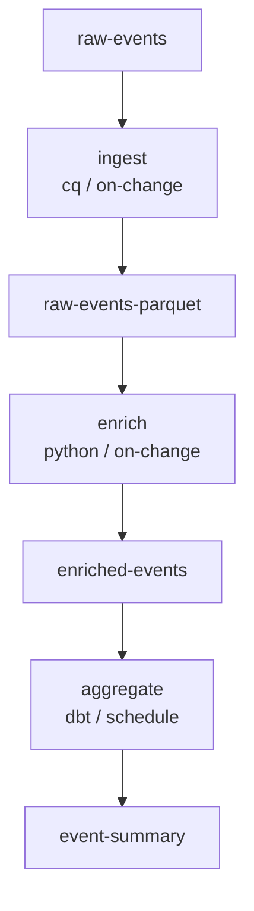

# Reactive Pipeline Model

## Problem

The current `PipelineWorkflow` is a single manifest listing ordered steps
(sync → transform → test → publish). This design forces **big-bang
deployment**: every team that touches the pipeline must coordinate releases,
and adding a new transform means editing a shared file.

For organisations with many teams, each owning transforms in different
repositories, this creates a scaling bottleneck.

## Proposal

Replace the orchestrated `PipelineWorkflow` with a **reactive, graph-based
model** where:

1. **Transforms are independently deployable** — each transform declares its
   inputs and outputs; no central pipeline manifest is needed.
2. **Inputs are reactive** — a transform declares *when* to run via a
   `trigger` policy (on-change, schedule, manual, or composite).
3. **Assets carry version + tags** — inputs can match by exact name *or* by
   tag selectors with semver ranges, enabling loose coupling.
4. **Pipeline is a query** — `dk pipeline show` walks the dependency graph
   starting from a root asset and renders the chain of transforms that
   produce that data. Multiple output formats are supported (text, mermaid,
   JSON, DOT).

## Contract Changes

### AssetRef (transform inputs/outputs)

```yaml
# Before
inputs:
  - asset: users

# After — exact name (still works)
inputs:
  - asset: users

# After — tag-based resolution with semver range
inputs:
  - tags:
      domain: identity
      tier: raw
    version: ">=1.0.0 <2.0.0"
```

New fields on `AssetRef`:

| Field     | Type              | Description                                     |
|-----------|-------------------|-------------------------------------------------|
| `asset`   | `string`          | Exact asset name (unchanged)                    |
| `cell`    | `string`          | Cell qualifier for cross-cell refs (unchanged)  |
| `tags`    | `map[string]string` | Match assets by labels (new)                  |
| `version` | `string`          | Semver range constraint (new)                   |

Exactly one of `asset` or `tags` must be specified (validated).

### Asset version

```yaml
apiVersion: datakit.infoblox.dev/v1alpha1
kind: Asset
metadata:
  name: users
  version: "1.2.0"          # ← new
  labels:
    domain: identity
    tier: raw
spec:
  store: warehouse
  table: public.users
```

`metadata.version` on Asset is a semver string. It enables tag-based
AssetRef resolution: a transform input `tags: {domain: identity, tier: raw},
version: ">=1.0.0"` matches this asset.

### TriggerSpec (replaces Schedule on Transform)

```yaml
spec:
  trigger:
    policy: on-change       # schedule | on-change | manual | composite
    # For schedule:
    schedule:
      cron: "0 */6 * * *"
    # For composite:
    policies:
      - on-change
      - schedule
```

| Policy       | Behaviour                                                |
|-------------|----------------------------------------------------------|
| `schedule`  | Runs on cron (same as before, cron spec nested)          |
| `on-change` | Runs when any input asset's data is updated              |
| `manual`    | Only runs on explicit `dk pipeline run` / API call       |
| `composite` | Combines multiple policies (any of them can trigger)     |

The existing `spec.schedule` field is kept for backward compatibility and is
treated as shorthand for `trigger: { policy: schedule, schedule: { ... } }`.

## Pipeline as a Query

`dk pipeline show` is enhanced to walk the asset dependency graph.

### How it works

1. Scan all `dk.yaml` files (recursively or in a configured set of dirs).
2. Build a DAG: each Transform becomes a node, edges are asset dependencies.
3. Render the graph starting from a root, destination, or showing everything.

### CLI

```bash
# Show full dependency graph (text tree)
dk pipeline show --all

# From a specific output asset
dk pipeline show --destination users-enriched

# Different output formats
dk pipeline show --all --output text      # default
dk pipeline show --all --output mermaid   # Mermaid diagram
dk pipeline show --all --output json      # JSON adjacency list
dk pipeline show --all --output dot       # Graphviz DOT

# Scan specific directories
dk pipeline show --all --scan-dir ./transforms --scan-dir ./assets
```

### Example: Three Chained Transforms

```
transforms/
  ingest/dk.yaml        → reads: raw-events          → writes: raw-events-parquet
  enrich/dk.yaml        → reads: raw-events-parquet  → writes: enriched-events
  aggregate/dk.yaml     → reads: enriched-events     → writes: event-summary

assets/
  raw-events/dk.yaml
  raw-events-parquet/dk.yaml
  enriched-events/dk.yaml
  event-summary/dk.yaml
```

```bash
$ dk pipeline show --destination event-summary

Pipeline Graph → event-summary
═══════════════════════════════

  raw-events
    │
    ▼
  ┌──────────────────┐
  │ ingest           │  trigger: on-change
  │ runtime: cq      │
  └──────────────────┘
    │
    ▼
  raw-events-parquet
    │
    ▼
  ┌──────────────────┐
  │ enrich           │  trigger: on-change
  │ runtime: python  │
  └──────────────────┘
    │
    ▼
  enriched-events
    │
    ▼
  ┌──────────────────┐
  │ aggregate        │  trigger: schedule (0 */6 * * *)
  │ runtime: dbt     │
  └──────────────────┘
    │
    ▼
  event-summary
```

Mermaid output:


## Migration

- **Existing transforms** that use `spec.schedule` continue to work — the
  field is kept and treated as shorthand for `trigger.policy: schedule`.
- **Existing `PipelineWorkflow`** manifests are still parseable but `dk
  pipeline show` now favours the graph-based view.
- **AssetRef** with only `asset` still works unchanged. `tags` and `version`
  are optional.

## Implementation Plan

1. Update `contracts/transform.go` — add `Tags`, `Version` to `AssetRef`;
   add `TriggerSpec` to `TransformSpec`.
2. Update `contracts/asset.go` — add `Version` to `AssetMetadata`.
3. Update JSON schemas (`transform.schema.json`, `asset.schema.json`).
4. Update `sdk/validate/manifest.go` — validate trigger policies, semver
   ranges, asset-or-tags exclusivity.
5. Add `dk pipeline show` graph mode to `cli/cmd/pipeline_show.go`.
6. Add three-transform example under `examples/`.
7. Update tests and documentation.
